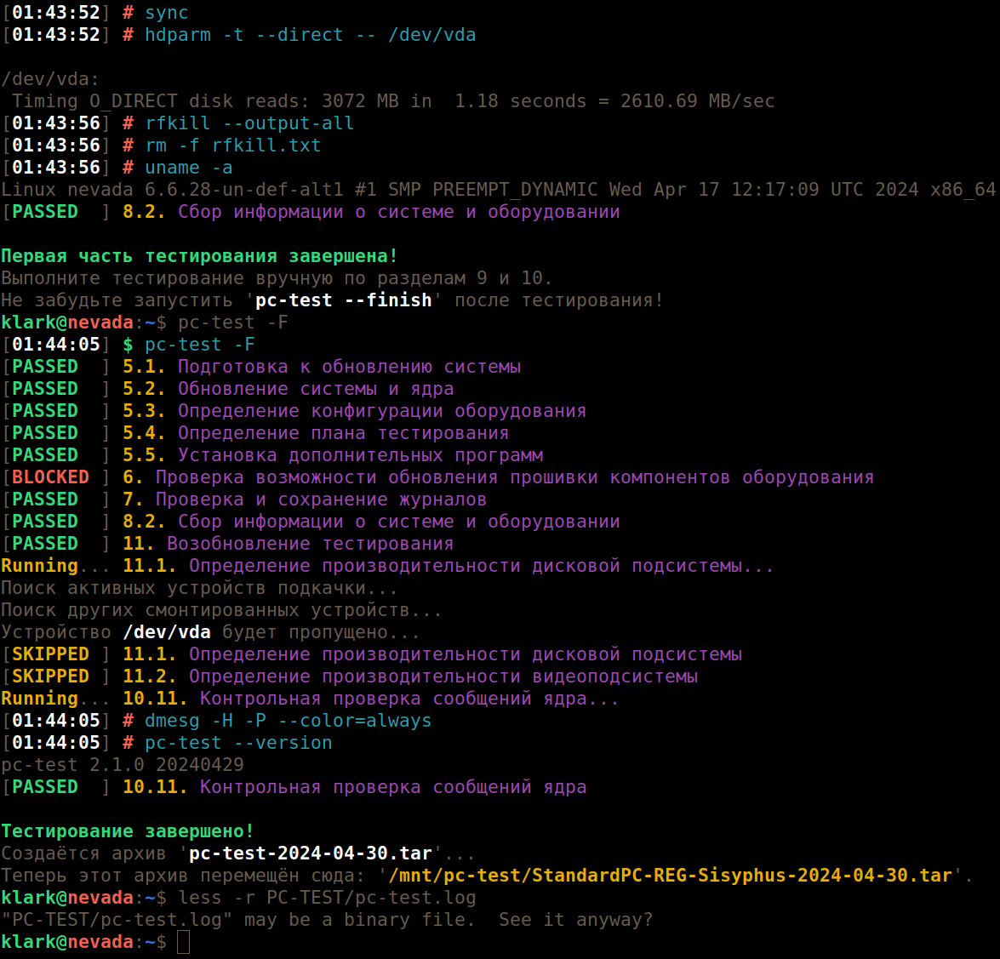

# PC-TEST

pc-test предназначена для упрощения и автоматизации прохождения тестирования
компьютеров на совместимость с ОС Альт по соответствующей методике. Текущая
версия pc-test автоматизрует разделы методики: 5-10.1, 10.11, 11.1 и 11.2,
а также доустанавливает пакеты, необходимые для всего процесса тестирования.
Актуальную версию методики тестирования компьютеров всегда можно найти
на [этой странице](https://www.basealt.ru/product-compatibility#c2278).
Теперь она включена ещё и в состав пакета `pc-test-doc` в формате HTML5.

## Системные требования

pc-test поддерживает [регулярные сборки](https://www.altlinux.org/Regular)
на основе Сизифа, а также [официально выпущенные](https://getalt.org/ru/)
дистрибутивы [ООО «Базальт СПО»](https://www.basealt.ru/) на основе бранчей
p9, p10, c9f1, c9f2 и c10f1, включая Альт СП (Альт 8 СП), сертифицированные
в ФСТЭК России, и [стартовые наборы](https://www.altlinux.org/Starterkits).

## Возможности pc-test

* обновление ОС и установка пакетов из публичных Интернет репозиториев;
* обновление ОС и установка пакетов из публичных архивов p9/p10/Сизифа;
* обновление ОС и установка пакетов с зеркала на подключаемом носителе;
* обновление ОС и установка пакетов с зеркала в локальной сети;
* автоматизировано переключение на требуемый репозиторий;
* автоматизировано обновление ОС сразу после развёртывания;
* поддерживаются специальные процедуры обновления Альт СП;
* автоматизирован сбор информации об ОС и оборудовании;
* конфигурирование тестов в графическом и текстовом режимах;
* имеется возможность доустановки графики на Альт СП Сервер релиз 10;
* поддерживается пакетный режим запуска программы с полным отказом от
  ручного конфигурирования и ввода данных (`--batch`);
* полностью автоматизировано прохождение некоторых тестов;
* имеется возможность повторно пройти ранее пройденный тест;
* поддерживаются две локали: русская и англо-американская.

Программа не предназначена для обновления продуктовых систем с большим
числом накопленных проблем. Нельзя гарантировать успех обновления во всех
случаях для репозитория Сизиф ввиду его нестабильности. Например, процедура
обновления не сможет выполнить переход на UsrMerge или автоматически решить
проблемы файловых или пакетных конфликтов, если с этим не справился APT. См.:

* https://www.altlinux.org/Usrmerge
* https://www.altlinux.org/Branches/Sisyphus#Ошибки_обновления

## Установка программы

Перед установкой программы нужно убедиться, что используется самая последняя
версия RPM-пакета. Проверить и скачать самую актуальную версию можно здесь:

https://packages.altlinux.org/ru/sisyphus/srpms/pc-test/rpms/

Сразу после окончания установки ОС Альт (раздел 4 методики) и возможного
применения необходимых воркэраундов из раздела 12.2 методики, программа
устанавливается следующей командой:

```bash
$ su-
# rpm -ivh [http://сервер]/путь/к/pc-test-версия-релиз.noarch.rpm
```

При этом минимально необходимые зависимости, скорее всего, обеспечиваются
чистой, только что установленной системой. Здесь важно, что, в отличии от
традиционного подхода к установке пакетов в ОС Альт, нет необходимости
предварительно настраивать репозиторий и обновлять индексы. В случае
возникновения проблем можно воспользоваться вторым способом установки:

```bash
# apt-get update
# apt-get install [http://сервер]/путь/к/pc-test-версия-релиз.noarch.rpm
```

При таком варианте минимально необходимые зависимости будут доустановлены
из подключенного репозитория установочного диска либо Интернет репозитория.

## Запуск программы

До запуска программы необходимо извлечь из компьютера все не относящиеся
к тестированию носители информации, отключить другие устройства, которые
не должны проходить тестирование по методике.

Программу следует запускать под обычным пользователем, если он существует,
чтобы иметь возможность выполнять тесты в сеансе обычного пользователя.
В этом случае будет настроена `sudo` для выполнения операций, требующих
привелегий `root`. Программу следует запускать в эмуляторе терминала
графического сеанса, при его доступности, а если графика не установлена,
тогда уже в текстовом терминале. При запуске программы под пользователем
`root` или в текстовом терминале, число охвачиваемых тестов уменьшается,
не пройденные тесты блокируются.

```bash
$ pc-test
```

После выполнения некоторых операций, таких, как обновление ядра или фирменной
прошивки, компьютер перезагружается, хотя тестирование ещё не было завершено.
Для продолжения тестирования в текстовом терминале pc-test придётся запускать
каждый раз вручную. При работе в графическом сеансе pc-test будет запускаться
автоматически до окончания первой фазы тестирования.

Если автозапуск в графическом сеансе не срабатывает ожидаемым образом, т.е.
после очередной перезагрузки окно эмулятора терминала с pc-test не появляется,
а в журнале есть фатальная ошибка, следует использовать ключ `--no-autorun`,
который запретит автозапуск. Для возобновления тестирования после такой ошибки
запустите вручную pc-test с ключом `--continue` (`-C`) из эмулятора терминала.

В случае крупного обновления в графическом сеансе, если вдруг закроется окно
эмулятора терминала или произойдёт выход из сеанса пользователя, достаточно
возобновить тестирование с той же точки, запустив pc-test с ключом `--continue`
(`-C`). Такое замечено, например, в среде KDE Plasma.

После тестирования вручную по разделам 10 и 11.3 методки, нужно запустить
pc-test ещё раз с параметром `--finish` (`-F`). При этом выполняется финальная
стадия сборки журналов (раздел 10.11 методики), а в домашнем каталоге текущего
пользователя создаётся архив вида `pc-test-ГГГГ-ММ-ДД.tar` с результатами
тестирования. При наличии каталога или символьной ссылки `/mnt/pc-test`, архив
переносится в этот каталог под именем `/mnt/pc-test/<ИМЯ_ТЕСТА>-ГГГГ-ММ-ДД.tar`,
где `ИМЯ_ТЕСТА` определяется автоматически и может изменяться через командную
строку параметром `--name` (`-n`). Дата начала тестирования также может быть
изменена параметром `--date` (`-d`), причём данный параметр предписывает
использовать ещё и архив публичного репозитория на заданную дату.

На подкаталог с результатами тестирования указывает символьная ссылка `PC-TEST`
в домашнем каталоге пользователя. Результаты ручного тестирования можно также
складывать в подкаталог `PC-TEST`. Журнал тестирования можно посмотреть такой
командой:

```bash
$ less -r ~/PC-TEST/pc-test.log
```

## Прохождение экспресс-теста

При наличии одновременно одного проводного сетевого адаптера и одного
беспроводного, нужно настроить и проверить работу Wi-Fi, затем подключить
сетевой кабель и убедиться, что работает проводная сеть. Также необходимо
предварительно настроить браузер на обычную работу — все вкладки закрыты,
при запуске не задаётся вопросов про настройку бумажника, восстановление
сеанса, итп. Если заведомо известно, что не работает «спящий» или «ждущий»
режим, его необходимо заблаговременно замаскировать: `systemctl mask
{suspend|hibernate}.target`, иначе экспресс-тест будет провален. Только
после этого запускается pc-test.

Когда дойдёте до раздела 9, компьютер будет выключен. Предлагается на
этом месте включить видеозапись происходящего. Очень важно дальше ничего
не нажимать, ничего не трогать и не двигать, экспресс-тест теперь полностью
автоматизирован. В самом конце этого теста, до перезагрузки, даётся 40 секунд
на ручную демонстрацию работы функциональных клавиш, других аудио и видео
устройств вывода. Видеозапись выключается сразу после завершения работы ОС,
когда компьютер уходит на перезагрузку.

Браузер выбирается автоматически единственный имеющийся или предпочитаемый.
Видео для воспроизведения выбирается случайным образом из более 80 сэмплов.
Если в файле конфигурации определить собственный сэмпл (`local_video_sample`),
то управлять плеером в окне браузера придётся вручную, согласно методике.

## Тонкая настройка

Для массового тестирования однотипных компьютеров, одного компьютера с разными
дистрибутивами ОС Альт, для использования локального зеркала репозитория, для
определения собственной цветовой палитры и других параметров, можно определить
свою конфигурацию в `/etc/pc-test.conf`, детали есть в комментариях внутри
этого файла. Данный файл конфигурации не заменяется при установке пакета.

## Внешний вид



[Другие скриншоты работы с программой](img/pictures.md).

## Получение справки

```bash
$ pc-test --help
```

Обратите внимание: локаль и ключи запуска программы определяются только в
самом начале тестирования. При последующих запусках pc-test менять локаль
и другие опции бесполезно.

Сообщайте об ошибках на https://bugzilla.altlinux.org/

Удачного тестирования! ;-)

