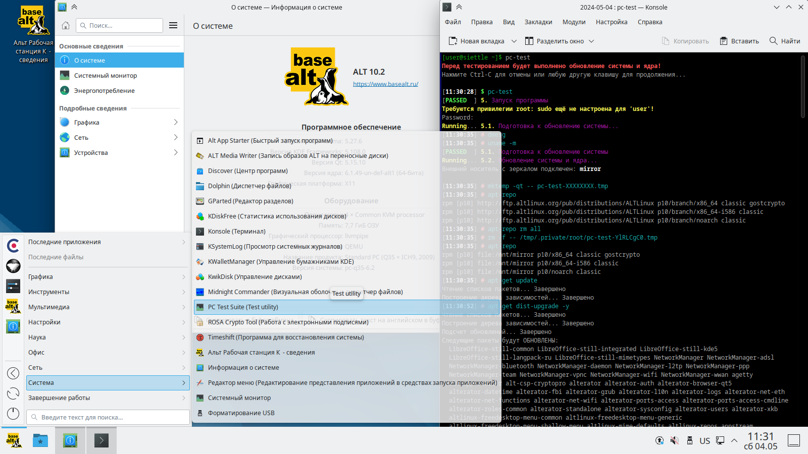
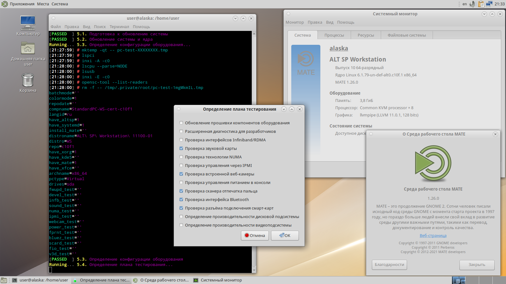
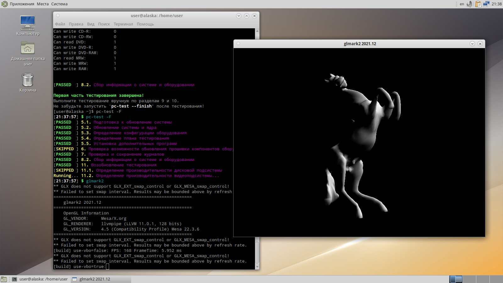
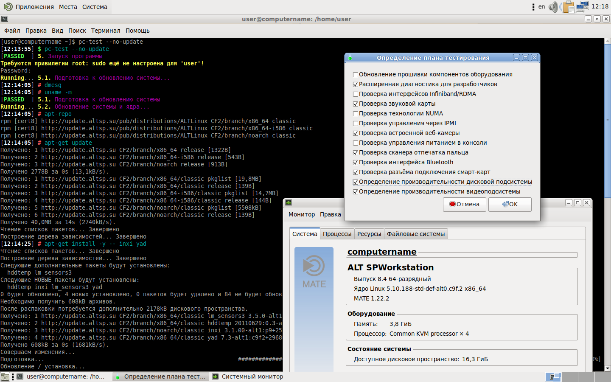
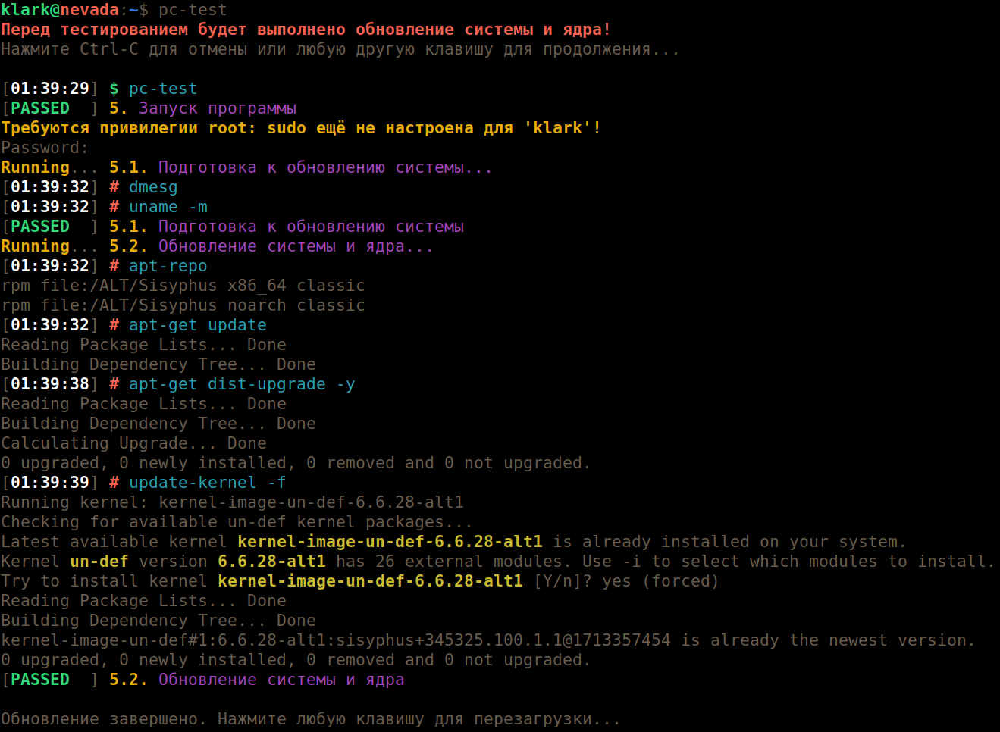
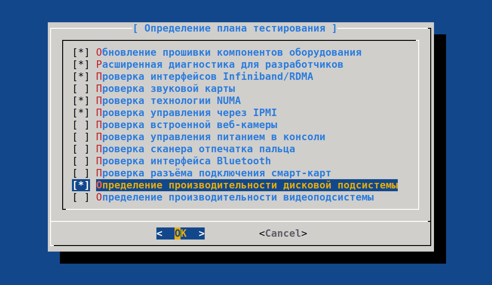
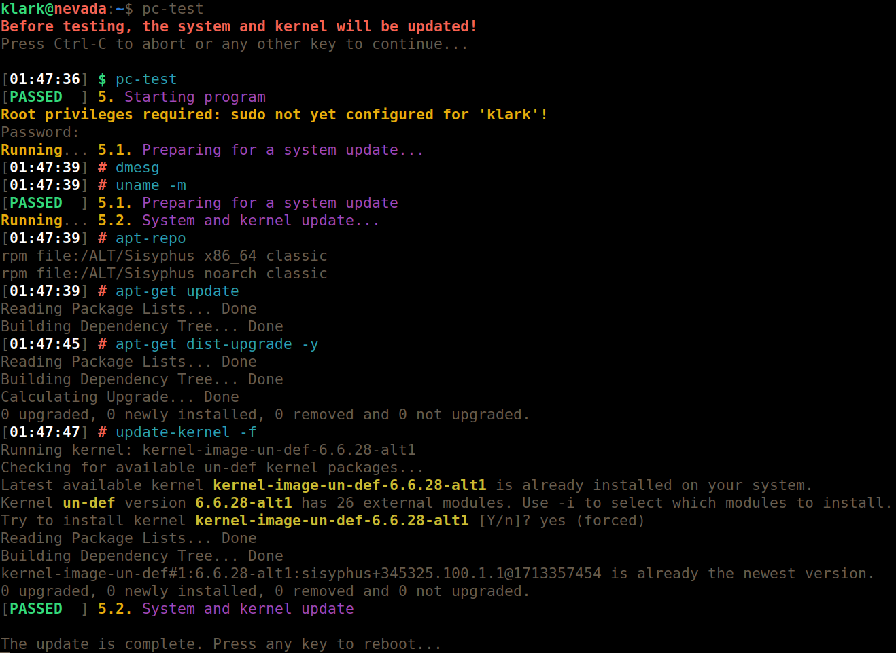
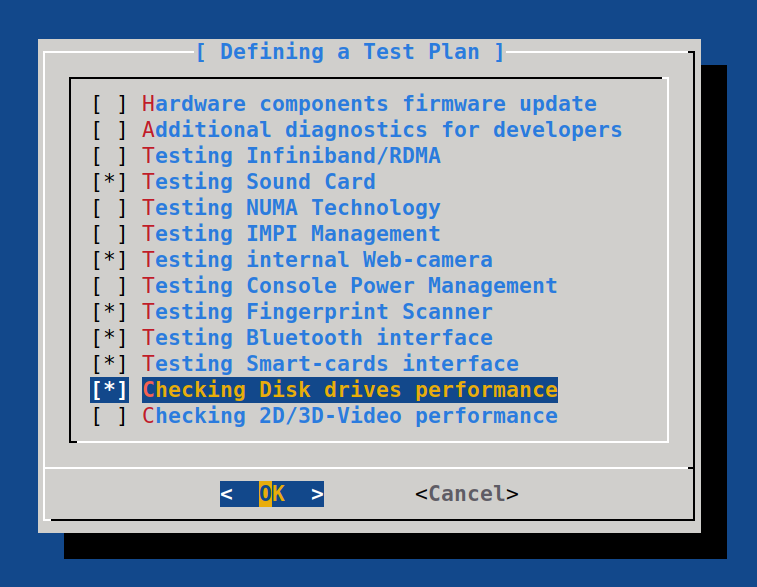
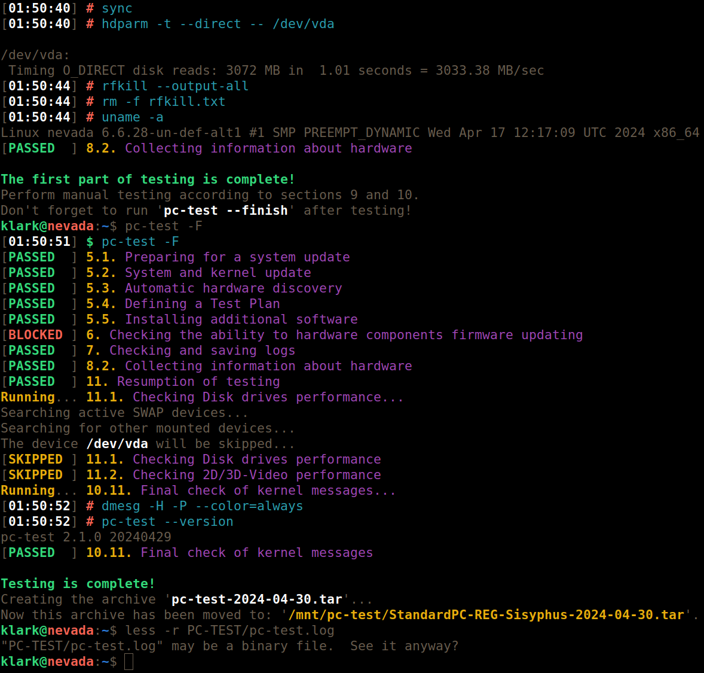
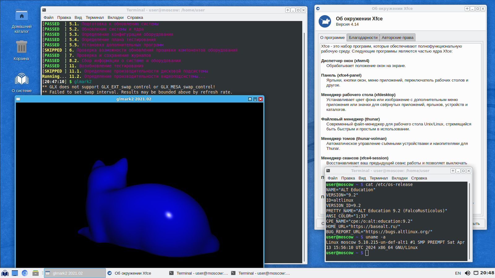

# Скриншоты

## Значок запуска в главном меню, Альт Рабочая станция К 10.2

## Определения плана тестирования, Альт СП Рабочая станция релиз 10

## Выполняется тест glmark2, Альт СП Рабочая станция релиз 10

## Определения плана тестирования, Альт 8 СП Рабочая станция /c9f2

## Первая часть обновления системы, Регулярная сборка на Сизифе

## Определения плана тестирования, Регулярная сборка на Сизифе

## Тестирование завершено, Регулярная сборка на Сизифе

## The first part of the system update, Regular build on Sisyphus

## Defining a Test Plan, Regular build on Sisyphus

## Testing is complete, Regular build on Sisyphus

## Выполняется тест glmark2, Альт Образование 9.2

